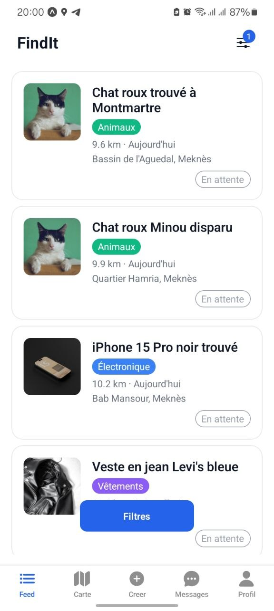
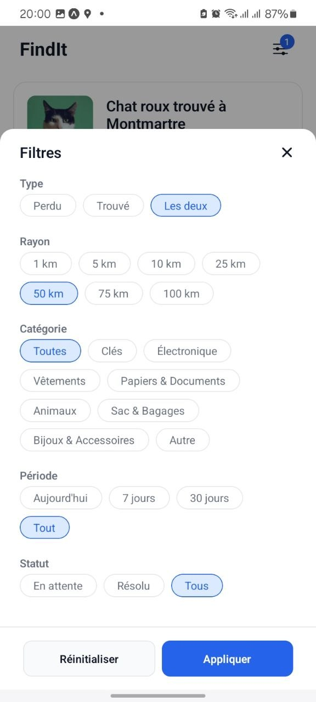
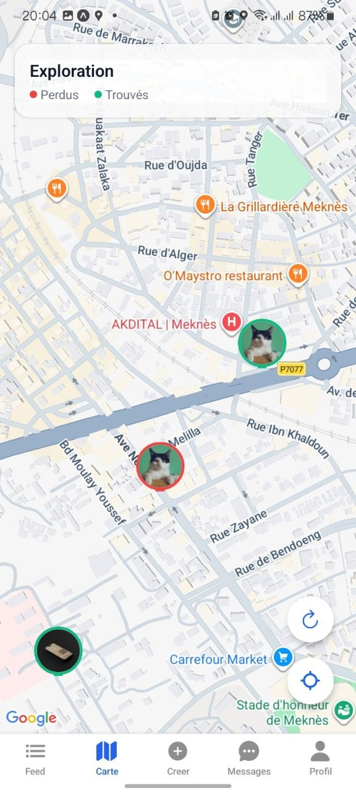
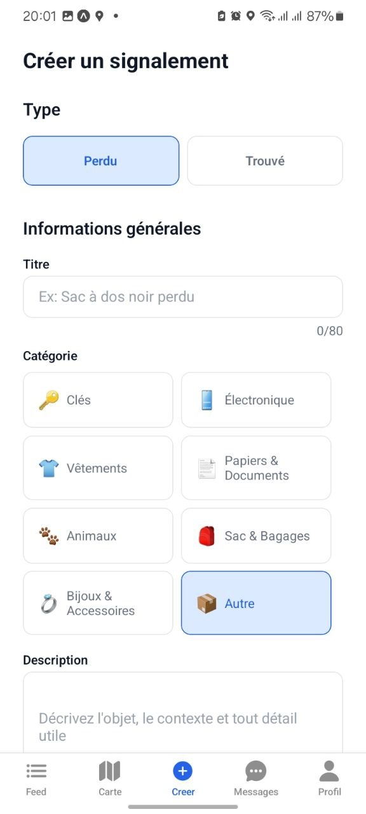
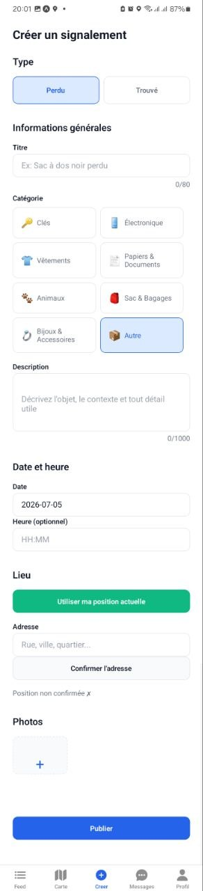
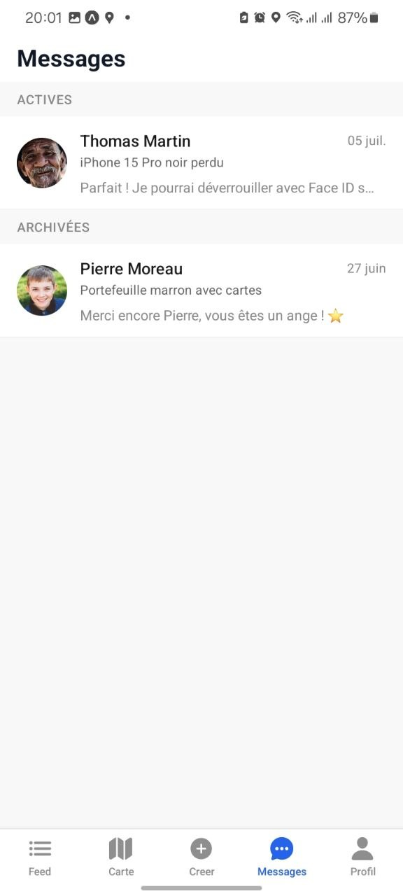

<!-- SEO Meta Tags -->
<!--
Description: findit is a mobile app that helps people find lost items by connecting lost-and-found reports through smart matching and real-time chat. Built with NestJS, PostgreSQL/PostGIS, and React Native (Expo).
Keywords: lost and found, findit, react native, expo, nestjs, postgresql, postgis, real-time chat, matching algorithm
author: Ayyoub EL Kouri, Taha Hammadate, Yassine El Barni
canonical: https://github.com/AyyoubElKouri/findit
-->

<!-- Open Graph / Facebook -->
<!--
og:type: website
og:url: https://github.com/AyyoubElKouri/findit
og:title: findit - Lost & Found Mobile App
og:description: A mobile application that intelligently connects people who lost items with those who found them, using smart matching and real-time chat.
og:image: https://raw.githubusercontent.com/AyyoubElKouri/findit/main/findit-mobile/assets/icon.png
-->

<!-- Twitter Card -->
<!--
twitter:card: summary_large_image
twitter:url: https://github.com/AyyoubElKouri/findit
twitter:title: findit - Lost & Found Mobile App
twitter:description: A mobile application that intelligently connects people who lost items with those who found them, using smart matching and real-time chat.
twitter:image: https://raw.githubusercontent.com/AyyoubElKouri/findit/main/findit-mobile/assets/icon.png
-->

<!-- GitHub Metadata -->
<!--
topics: react-native, expo, nestjs, typescript, postgresql, postgis, socket-io, lost-and-found, mobile-app, real-time
languages: typescript
-->

<div align="center">

# findit

### Smart Lost & Found - Connect, Match, Return

[](LICENSE)
[](#)
[](#)


[**Explore Docs**](#) • [**Report Bug**](https://github.com/AyyoubElKouri/findit/issues) • [**Request Feature**](https://github.com/AyyoubElKouri/findit/issues)

</div>

---

## About

**findit** is a mobile application that helps reunite people with their lost belongings. Users can report lost or found items, and the app intelligently matches reports using geographic proximity and category similarity. When a match is detected, both parties are connected through a real-time chat to arrange the return.

Built with a NestJS API backed by PostGIS for spatial queries and an Expo/React Native mobile app with an interactive map.

### Why findit?

- **Smart matching** - The system compares lost and found reports by location, category, and time to surface likely matches automatically.
- **Real-time communication** - Socket.io-powered chat lets users coordinate returns without sharing personal contact info.
- **Built-in trust** - User reviews, content flagging, and moderation tools keep the community safe.

---

## Features

<table>
  <tr>
    <td>

**Report Items**
- Report lost or found items with title, description, category, date, time, and precise location
- Upload multiple photos per report (Cloudinary-backed)
- Browse reports in a feed with infinite scroll and filters

    </td>
    <td>

**Interactive Map**
- View all visible reports as markers on a map
- Tap markers to see item details
- Filter by category and report type

    </td>
  </tr>
  <tr>
    <td>

**Smart Matching**
- Automatic matching between lost and found reports
- Score-based ranking using location proximity, category overlap, and date ranges
- Matched users get notified and can start a conversation

    </td>
    <td>

**Real-Time Chat**
- One-on-one conversations between matched users
- Conversation lifecycle: pending → active → archived
- Push notifications for new messages

    </td>
  </tr>
  <tr>
    <td>

**Authentication**
- Email/password registration with email verification
- Google OAuth and Apple Sign In
- JWT-based sessions with refresh token rotation
- Forgot/reset password flow

    </td>
    <td>

**Trust & Safety**
- User reviews and ratings after completed returns
- Flag inappropriate content for moderation
- Report visibility controls and moderation queue

    </td>
  </tr>
</table>

---

## Screenshots

<p align="center">
  
  
  
</p>
<p align="center">
  <em>Feed · Filters · Map</em>
</p>

<p align="center">
  
  
  
</p>
<p align="center">
  <em>Create report · Location & photos · Chat</em>
</p>

---

## Tech Stack

| Layer | Technologies |
|-------|-------------|
| **Mobile** | React Native 0.81, Expo 54, TypeScript |
| **State** | zustand, react-hook-form + zod |
| **Navigation** | React Navigation 7 (stack + bottom tabs) |
| **Maps** | react-native-maps, expo-location |
| **API** | NestJS 11, TypeScript, TypeORM |
| **Database** | PostgreSQL 16 + PostGIS 3.4 |
| **Real-time** | Socket.io (server + client) |
| **Auth** | Passport.js (JWT, Google OAuth 2.0, local) |
| **Storage** | Cloudinary (images) |
| **Push** | Expo Push Notifications |
| **Infra** | Docker Compose (PostGIS + pgAdmin) |

<details>
<summary><b>View all dependencies</b></summary>

### API (findit-api)

**Core:** `@nestjs/common`, `@nestjs/core`, `@nestjs/config`, `@nestjs/typeorm`, `@nestjs/jwt`, `@nestjs/passport`, `@nestjs/platform-socket.io`, `@nestjs/websockets`, `@nestjs/schedule`, `@nestjs/event-emitter`

**Data:** `typeorm`, `pg`, `class-transformer`, `class-validator`, `joi`

**Auth:** `passport`, `passport-jwt`, `passport-local`, `passport-google-oauth20`, `bcrypt`

**Integrations:** `cloudinary`, `expo-server-sdk`, `socket.io`, `uuid`

### Mobile (findit-mobile)

**Core:** `expo`, `react`, `react-native`, `typescript`

**Navigation:** `@react-navigation/native`, `@react-navigation/native-stack`, `@react-navigation/bottom-tabs`

**State:** `zustand`, `react-hook-form`, `zod`

**UI:** `@expo/vector-icons`, `expo-image`, `react-native-gesture-handler`, `react-native-reanimated`

**Features:** `react-native-maps`, `expo-location`, `expo-image-picker`, `expo-notifications`, `socket.io-client`, `axios`

</details>

---

## Getting Started

### Prerequisites

- Node.js 22+
- Docker & Docker Compose
- Expo CLI (`npx expo`)

### Installation

**1. Clone the repository**

```bash
git clone https://github.com/AyyoubElKouri/findit.git
cd findit
```

**2. Start the API and database**

```bash
cd findit-api
cp .env.example .env   # then edit .env with your values
npm install
npm run docker:up       # starts PostGIS + pgAdmin
npm run start:dev       # starts NestJS on http://localhost:3000
```

**3. Start the mobile app**

```bash
cd findit-mobile
npm install
npx expo start
```

Scan the QR code with Expo Go, or press `a` for Android emulator / `i` for iOS simulator.

---

## Project Structure

```
findit/
├── findit-api/                # NestJS backend
│   ├── src/
│   │   ├── config/            # Environment configuration
│   │   ├── modules/
│   │   │   ├── auth/          # Authentication (JWT, Google OAuth, Apple)
│   │   │   ├── conversations/ # Matched-item conversations
│   │   │   ├── flags/         # Content moderation flags
│   │   │   ├── matching/      # Smart lost/found matching engine
│   │   │   ├── messages/      # Real-time chat (Socket.io gateway)
│   │   │   ├── notifications/ # Push notification dispatch
│   │   │   ├── reports/       # Lost & found item reports
│   │   │   ├── reviews/       # User reviews & ratings
│   │   │   ├── upload/        # Image upload (Cloudinary)
│   │   │   └── users/         # User profiles & settings
│   │   └── main.ts            # App entry point
│   ├── test/                  # E2E and unit tests
│   ├── docker-compose.yml     # PostGIS + pgAdmin
│   └── package.json
├── findit-mobile/             # Expo/React Native app
│   ├── src/
│   │   ├── api/               # API client modules
│   │   ├── components/        # Reusable UI components
│   │   ├── constants/         # Categories, theme tokens
│   │   ├── hooks/             # Custom hooks (infinite scroll, location)
│   │   ├── navigation/        # React Navigation config
│   │   ├── screens/           # Auth, feed, map, chat, profile screens
│   │   ├── services/          # Socket.io client
│   │   ├── store/             # zustand stores
│   │   ├── types/             # TypeScript type definitions
│   │   └── utils/             # Formatting, token storage, error handling
│   ├── App.tsx                # App root (notifications, socket, navigation)
│   └── package.json
└── README.md
```

---

## API Overview

| Method | Endpoint | Description |
|--------|----------|-------------|
| `POST` | `/auth/register` | Register a new account |
| `POST` | `/auth/login` | Login with email/password |
| `POST` | `/auth/google` | Login with Google OAuth |
| `POST` | `/auth/apple/callback` | Login with Apple |
| `GET` | `/auth/verify-email` | Verify email address |
| `POST` | `/auth/forgot-password` | Request password reset |
| `POST` | `/auth/reset-password` | Reset password with token |
| `GET` | `/reports` | List reports (paginated, filterable) |
| `POST` | `/reports` | Create a lost or found report |
| `GET` | `/reports/:id` | Get report details |
| `PATCH` | `/reports/:id` | Update a report |
| `DELETE` | `/reports/:id` | Delete a report |
| `GET` | `/matching/reports` | Get potential matches for a report |
| `POST` | `/conversations` | Start a conversation from a match |
| `GET` | `/conversations` | List user's conversations |
| `PATCH` | `/conversations/:id/respond` | Accept/refuse/archive a conversation |
| `POST` | `/messages` | Send a message in a conversation |
| `GET` | `/messages/:conversationId` | Get messages for a conversation |
| `POST` | `/flags` | Flag a report for moderation |
| `POST` | `/reviews` | Submit a review after a return |
| `GET` | `/users/me` | Get current user profile |
| `PATCH` | `/users/me` | Update profile |

---

## Contributing

1. Fork the repository
2. Create your feature branch (`git checkout -b feature/AmazingFeature`)
3. Commit your changes (`git commit -m 'feat: add AmazingFeature'`)
4. Push to the branch (`git push origin feature/AmazingFeature`)
5. Open a Pull Request

---

## License

MIT License - see the [LICENSE](LICENSE) file for details.

---

<div align="center">

**findit** - Built by [Ayyoub EL Kouri](https://github.com/AyyoubElKouri), [Taha Hammadate](https://github.com/hammtah), [Yassine El Barni](https://github.com/yassineelbarni-u)

</div>
